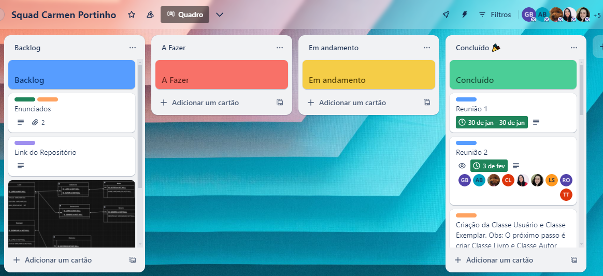

##  Índice 
- [Exercício Orientação a Objeto em Python](#poo)
- [Exercício Banco de Dados](#bd)
- [Organização dos Execícios](#organizacao)
- [Integrantes](#integrantes)

##  Exercício Orientação a Objeto em Python 

### 📝 Enunciado

`Gerenciamento de Biblioteca:` Vamos criar um sistema orientado a objetos para representar um sistema de biblioteca seguindo os requisitos abaixo:
1. Cada livro pode ter um ou mais autores.
2. A biblioteca controla apenas o nome, o telefone e a nacionalidade de cada usuário.
3. Cada livro tem um título, editora, uma lista de gêneros aos quais pertence e uma lista de exemplares disponíveis.
4. Quando um exemplar é emprestado, ele é removido da lista de exemplares disponíveis.
5. Alguns livros podem ter um número máximo de renovações permitidas.
6. A biblioteca mantém um registro de todos os empréstimos realizados, incluindo detalhes como data de empréstimo, data de devolução e estado do exemplar (por exemplo, emprestado ou devolvido).

Para modelar o sistema, utilize obrigatoriamente os conceitos de classe, herança, propriedade, encapsulamento e classe abstrata.

### 💻 Resolução
O exercício foi realizado no seguinte repositório: [Link](https://github.com/gabiapp/ProjetoBibliotecaSquadCarmenPortinho/tree/ExerciciosPOO_SquadCarmenPortinho).

##  Exercício Banco de Dados 

### 📝 Enunciado

`Exercício Gerenciamento Biblioteca:`
1. Criação das Tabelas:
- Utilizando SQL, crie as tabelas necessárias para armazenar as informações do sistema. Certifique-se de definir as chaves primárias e estrangeiras conforme apropriado.
2. Inserção de Dados:
- Insira dados de exemplo nas tabelas para simular um ambiente de biblioteca. Certifique-se de incluir uma variedade de livros, autores e editoras.
3. Consultas SQL: Escreva consultas SQL para realizar as seguintes operações:
- Listar todos os livros disponíveis.
- Encontrar todos os livros emprestados no momento.
- Localizar os livros escritos por um autor específico.
- Verificar o número de cópias disponíveis de um determinado livro.
- Mostrar os empréstimos em atraso.
4. Atualizações e Exclusões:
- Escreva consultas SQL para atualizar e excluir registros do banco de dados, por exemplo, para marcar um livro como devolvido ou remover um autor.

### 💻 Resolução
Diagrama de Entidade e Relacionamento (ER)

.png)

O exercício foi realizado no seguinte repositório: [Link](https://github.com/gabiapp/ProjetoBibliotecaSquadCarmenPortinho/tree/ExerciciosBancoDeDados_SquadCarmenPortinho).

##  Organização dos Execícios 

Os exercícios foram resolvidos em grupo através de chamadas via discord e organizados de acordo com um quadro Kanban no Trello: 

##  Integrantes 

<table>
  <tr>
    <td align="center"><a href="https://github.com/alynebrasil"> <b>Alyne Brasil</b></a> <a href="https://github.com/alynebrasil">👩‍💻</a></td>
    <td align="center"><a href="https://github.com/anamariagds"> <b>Ana Maria Gomes</b></a> <a href="https://github.com/anamariagds">👩‍💻</a></td>
    <td align="center"><a href="https://github.com/cibelemoraes"> <b>Cibelle Moraes</b></a> <a href="https://github.com/cibelemoraes">👩‍💻</a></td>
    <td align="center"><a href="https://github.com/danisoaresl"> <b>Daniele Soares</b></a> <a href="https://github.com/danisoaresl">👩‍💻</a></td>
    <td align="center"><a href="https://github.com/gabiapp"> <b>Gabriela Nunez</b></a> <a href="https://github.com/gabiapp">👩‍💻</a></td>
    </tr>
    <tr>
    <td align="center"><a href="https://github.com/GessycaBorges"> <b>Gessyca Borges</b></a> <a href="https://github.com/GessycaBorges">👩‍💻</a></td>
    <td align="center"><a href="https://github.com/OrcFofa"> <b>Laura Santos</b></a> <a href="https://github.com/OrcFofa">👩‍💻</a></td>
    <td align="center"><a href="https://github.com/liviazeviani"> <b>Lívia Zeviani</b></a> <a href="https://github.com/liviazeviani">👩‍💻</a></td>
    <td align="center"><a href="https://github.com/Renatarafaelaalves"> <b>Renata Rafaela Alves</b></a> <a href="https://github.com/Renatarafaelaalves">👩‍💻</a></td>
    <td align="center"><a href="https://github.com/thaynarlt"> <b>Thayná Tolentino</b></a> <a href="https://github.com/thaynarlt">👩‍💻</a></td>
    
  </tr>
</table>
